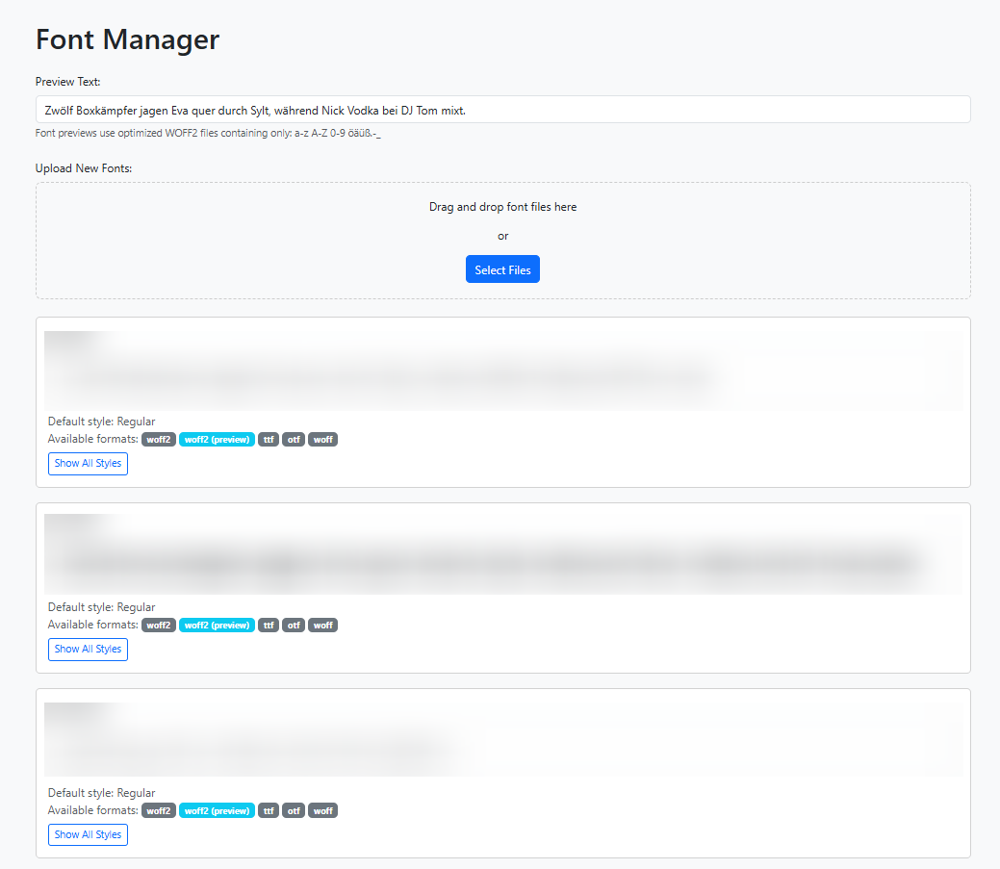

# FontManager

A simple python application. where ttf and otf Files can be uploaded and are listed within a simple UI.  
Can be used for graphical agencies to manage used fonts.  
Automatically converted to woff and woff2.

## Features

  - Just Drag & Drop ttf or otf files to upload them into **data/fonts** folder
  - Create woff and woff2 files from ttf, otf
  - Show SubFamilies, when recognized from ttf, from thin to bold for a font family

## How to use

  - Just pull the repository
  - Run `pip install -r requirements.txt` within an virtuel environment
  - Run `python backend/dev.py`
  - Open http://localhost:8000 in Browser

## Disclaimer

This application was not well planned and developed manually.  
Almost everything, except some details are implemented by Claude.AI Sonnet-3.7 and VSCode Extension Cline and checked myself.